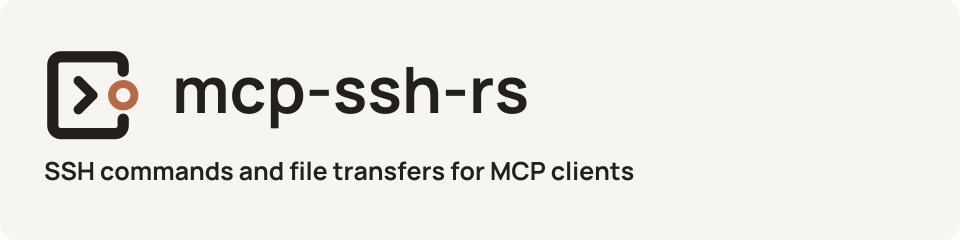
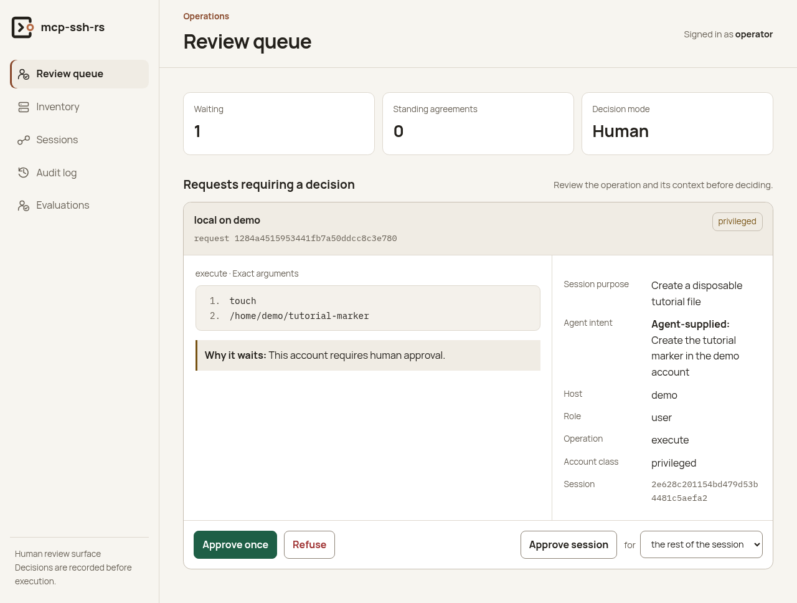

# mcp-ssh-rs

<picture>
  <source media="(max-width: 600px) and (prefers-color-scheme: dark)" srcset="docs/branding/assets/wordmark-dark.svg">
  <source media="(max-width: 600px)" srcset="docs/branding/assets/wordmark-light.svg">
  <source media="(prefers-color-scheme: dark)" srcset="docs/branding/assets/header-dark.svg">
  
</picture>

**SSH commands and file transfers for AI agents, with optional human approval.**

Connect an MCP client to your configured SSH accounts. Review proposed commands
in a browser, collect their results, and inspect the execution record.
MCP (Model Context Protocol) lets an AI client use these operations as tools.

**[Try the local demo](#try-it-locally)** ·
**[Explore the documentation](docs/README.md)** ·
**[Contribute](CONTRIBUTING.md)** · **[Get help](SUPPORT.md)**

<picture>
  <source media="(max-width: 600px) and (prefers-color-scheme: dark)" srcset="docs/images/approval-mobile-dark.png">
  <source media="(max-width: 600px)" srcset="docs/images/approval-mobile.png">
  <source media="(prefers-color-scheme: dark)" srcset="docs/images/approval-dark.png">
  
</picture>

Review the proposed command and its purpose before choosing **Approve once**.
The client then collects the decision and result. This is the actual
[disposable demo](docs/quickstart.md), with a non-root SSH account.
[View the screenshot at full size](docs/images/approval.png).

## Things to try

**Inspect a configured server.** Let an agent discover the available hosts and
accounts, open a session, and collect a command's output.
[Configure your first host](docs/operations.md#add-a-host).

**Review a proposed change.** See the target, exact command arguments, and
agent's stated purpose together in the browser. Try creating a file on a
disposable target and collecting the approved result.
[Follow the approval walkthrough](docs/quickstart.md#request-approval).

**Move files over SFTP.** Upload a file or retrieve a binary artifact using file
references. [Set up file transfers](docs/file-transfers.md).

**Collect large command results as files.** Keep bulk output outside the model's
context and retrieve it through the configured byte channel.
[Choose a file channel](docs/file-transfers.md).

## Try it locally

This is an early 0.1 project; interfaces and configuration may change.
For an identified container, use the [release installation guide](docs/installation.md).
The demonstration below builds from source on Docker with a local Linux
daemon and Compose v2 or newer. You also need Python 3.11 or newer,
OpenSSH's `ssh-keygen`, and a browser. The first build downloads public
dependencies and takes several minutes.

```sh
git clone https://github.com/chrisbennight/mcp-ssh-rs.git
cd mcp-ssh-rs
python3 examples/quickstart/demo.py start
python3 examples/quickstart/demo.py request
```

The request reports `outcome: "awaiting_approval"`. Open the dashboard URL
printed at startup. Sign in as `operator`, reading the generated password
locally from `.quickstart/operator-password`. Review the marker-file request
and choose **Approve once**, then collect the result:

```sh
python3 examples/quickstart/demo.py collect
```

The completed result includes:

```json
{"outcome": "ran", "exit": 0}
```

This excerpt omits the generated identifiers and other result fields. If you
have not approved yet, the request remains waiting. Approval alone does not
execute the command; collection is part of the workflow.

The demo runs against a disposable SSH target on your computer. It needs no
gateway, identity provider, model account, or private infrastructure. The full
[tutorial](docs/quickstart.md) covers the execution record, other MCP clients,
and [common failures](docs/quickstart.md#common-failures).

When finished, remove the demo containers and generated files:

```sh
python3 examples/quickstart/demo.py stop
```

Downloaded and built images remain cached. Before connecting real hosts, read
the [operating guide](docs/operations.md) and the
[design's non-goals and preconditions](docs/design.md#non-goals-and-preconditions).

## Go further

Use [the documentation guide](docs/README.md) to connect a client, configure
hosts, transfer files, and operate the service. The service supports standalone
stdio or HTTP, with optional gateway integration; the guide explains the
configuration each route needs.

[Get help or report a bug](SUPPORT.md) ·
[Contribute](CONTRIBUTING.md) · [Report a vulnerability](SECURITY.md) ·
[Published releases](https://github.com/chrisbennight/mcp-ssh-rs/releases) ·
[Changelog](CHANGELOG.md)

## License

[Apache License 2.0](LICENSE).
